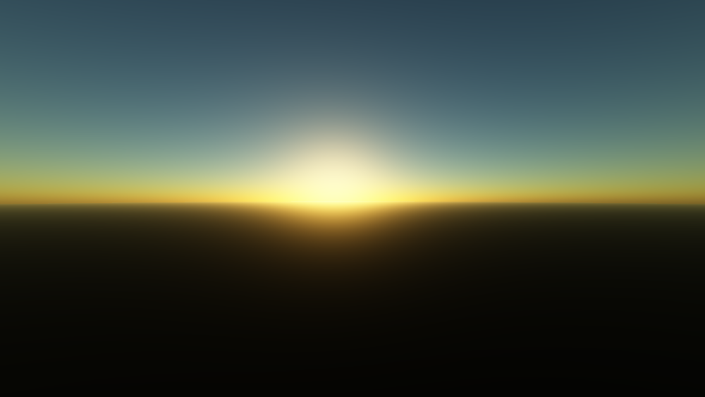
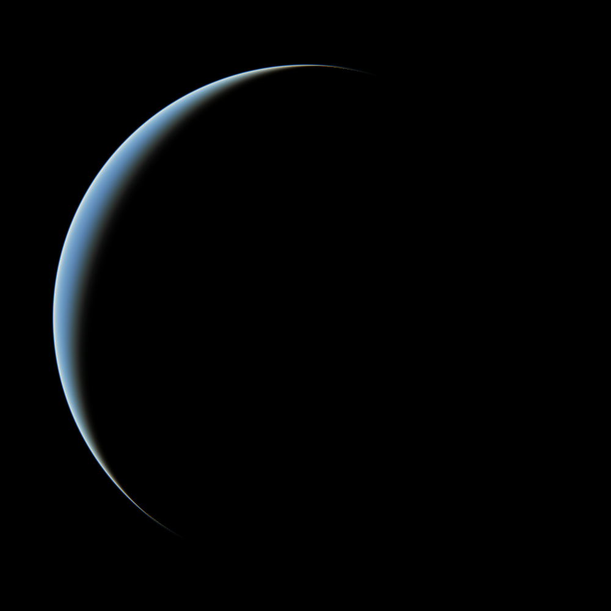
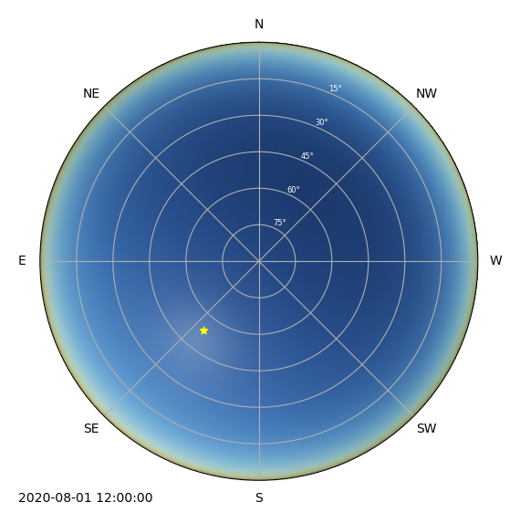

# Firmament

Visualization of the sky's color using ray marching to model Rayleigh and Mie scattering.

| Example                | Description                                                      |
| ---------------------- | ---------------------------------------------------------------- |
|`sunrise.py`            | Plain sky view with arbitrary sun direction                      |
|`bluedot.py`            | Atmosphere seen from space                                       |
|`local_sunrise.py`      | Course of the sun as seen from a given position at a given time  |
|`fancy_local_sunrise.py`| The full firmament as seen from a given position at a given time |

## Preview

## Literature

* Nishita et al. _Display of the Earth Taking into Account Atmospheric Scattering._ In Proceedings of the 20th Annual Conference on Computer Graphics and Interactive Techniques - SIGGRAPH ’93, 175–82. ACM Press, 1993. `10.1145/166117.166140`
* Hillaire. _Physically Based Sky, Atmosphere and Cloud Rendering in Frostbite_
* _Appendix D: Solar radiation_, ME 4131: Thermal Environmental Engineering Laboratory Manual
